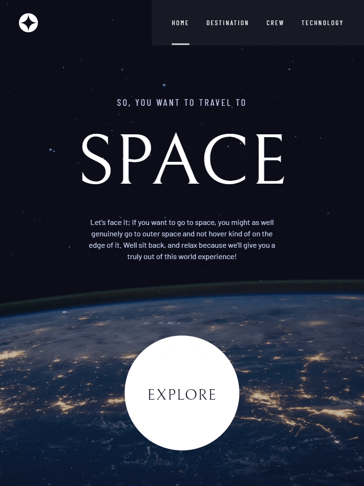

# Frontend Mentor - Space tourism website solution

This is a solution to the [Space Tourism website challenge on Frontend Mentor](https://www.frontendmentor.io/challenges/space-tourism-multipage-website-gRWj1URZ3). Frontend Mentor challenges help you improve your coding skills by building realistic projects. 

## Table of contents

- [Overview](#overview)
  - [The challenge](#the-challenge)
  - [Previews](#previews)
  - [Links](#links)
- [My process](#my-process)
  - [Built with](#built-with)
  - [What I learned](#what-i-learned)
  - [Continued development](#continued-development)
  - [Useful resources](#useful-resources)
- [Author](#author)

## Overview

### The challenge

Users should be able to:

- View the optimal layout for each of the website's pages depending on the device's screen size
- See hover states for all interactive elements on the page
- View each page and be able to toggle between the tabs to see new information

### Previews

Desktop Version

Tablet Version

Mobile Version

### Links

- Solution URL: [Frontend Mentor Solution](https://www.frontendmentor.io/solutions/space-tourism-website-using-react-and-tailwind-xk_KhaKCRN)
- Live Site URL: [Space Tourism Website](https://patrick-dolan.github.io/space-tourism-website/)

## My process

### Built with

- Semantic HTML5 markup
- CSS custom properties
- Mobile-first workflow
- [React](https://reactjs.org/) - JS library
- [TailwindCSS](https://tailwindcss.com/) - CSS Framework
- [Vite](https://vitejs.dev/) - Frontend Tooling

### What I learned

The two most important things I learned during this project were how to use Vite's public directory for static assets and how to use TailwindCSS for styling. 

**First was the public directory:**

I originally had a `data.json` file with relative paths to the different images in my assets folder located in the `src/` directory. I was able to make it work but importing and deconstructing the information I needed and appending a string with the src folder to get the images displayed in an `img` tag. 

This worked throughout development as the most important part of this challenge was styling and layout, and I just needed the images on the page so I could style them. The problem arose when trying to deploy the finished site to GitHub pages. The relative paths no longer worked and since Vite bundles the code during the build process the paths no longer had access to the `src/` directory. 

My solution was to move my assets into the public folder and change the paths in the `data.json` file to use the public asset paths. This took quite a few iterations since I tried many other methods first but I got there in the end and decided to change the file type from `.png` to `.webp` for performance reasons.

The other thing I had to refactor due to using a base path with Vite was to adjust my routing system paths to match the GitHub pages format. 

**Then there was Tailwind:**

I did a good bit of research on different methods for styling in React. Up to this point, I have used a mix of inline styles, huge unwieldy global stylesheets, Bootstrap, or MaterialUI for most of my projects. I looked into "styled-components" and CSS modules as other alternatives but have heard so much about Tailwind that I decided to give it a shot. 

I thoroughly enjoyed using Tailwind. Sometimes it feels like the number of `classNames` gets a bit out of control and I could see how even more complex sites could be a challenge to manage, but overall I enjoy the utility-first design. 

I think one of the biggest things I want to work on in the future when using Tailwind is how I manage the layouts. I had a habit of adding spacing directly in the element I wanted to move when I thought having less styling in a reusable component like `PageHeader.jsx` and instead just wrapping it in a div with the layout classes in the actual web page component made more sense.

### Continued development

My biggest takeaway from this project is the use of TailwindCSS. I plan to continue to use it and learn more about how to use it best since I have, to this point, been using a mix of inline styles and huge barely manageable global stylesheets. 

I looked into CSS modules and "styled-components" before committing to learning Tailwind and overall I am happy with how it works. I do think there are some big things I can improve on with Tailwind since sometimes the number of class names gets a bit hard to read.

This is also the first project where I had a Figma file and wow it's a game changer. Having a file where I can check exact fonts, distances between elements, sizes of borders, etc... is amazing. I understand why so many web developers I've listened to on YouTube and other places swear by Figma.  

### Useful resources

- [Tailwind Docs](https://tailwindcss.com/docs/installation) - This is the first project I have created with TailwindCSS so the docs came in incredibly useful for both installing it and using it throughout the project. 
- [Vite](https://vitejs.dev/guide/assets.html#static-asset-handling) - This particular page of the Vite docs, on static asset handling, was integral to the success of this project. I've mostly used create-react-app in the past, and I had to do some major refactors since I am used to using an image loader as opposed to the public directory for static images. 

## Author

- Website - [Patrick Dolan](https://patrickdolan.dev/)
- Frontend Mentor - [@Patrick-Dolan](https://www.frontendmentor.io/profile/Patrick-Dolan)